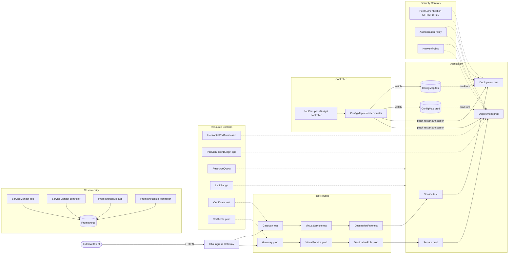

# Shipshape

This repository delivers:
- A Python `helloworld` HTTP service returning a message from a Kubernetes `ConfigMap`.
- Kustomize manifests for `test` and `prod` on the same cluster and same namespace.
- Istio host-based ingress with TLS certificates from cert-manager.
- A Python controller that watches `ConfigMap` changes and triggers rolling restarts.

## Quickstart

Run the full setup, checks, and Kind E2E in one command:

```bash
./quickstart
```

### Deploy and verify

`make deploy` demonstrates the full config-change-to-response cycle: it updates
the ConfigMap message, reapplies the Kustomize overlay, triggers a rolling
restart, and curls the running service to prove the new message is live.

```bash
make deploy              # targets the test environment (default, ENV=test)
make deploy ENV=prod     # targets the prod environment
```

The target walks you through each step:

1. **Shows the current MESSAGE** from the overlay's `app-vars.yaml`.
2. **Prompts for a new message** — type a new value or press Enter to keep the
   existing one.
3. **Applies the overlay** (`kubectl apply -k k8s/overlays/<ENV>`).
4. **Restarts the deployment** and waits for the rollout to complete.
5. **Curls the service** via a temporary port-forward and prints the response,
   confirming the app now returns the updated ConfigMap value.

Example session (`test`):

```
$ make deploy
Current MESSAGE: hello from configmap
Enter new MESSAGE (or press Enter to keep): greetings from test
Updated MESSAGE to: greetings from test
…
deployment.apps/helloworld-test restarted
deployment "helloworld-test" successfully rolled out
greetings from test
```

Example session (`prod`):

```
$ make deploy ENV=prod
Current MESSAGE: hello from configmap
Enter new MESSAGE (or press Enter to keep): greetings from prod
Updated MESSAGE to: greetings from prod
…
deployment.apps/helloworld-prod restarted
deployment "helloworld-prod" successfully rolled out
greetings from prod
```

The message value lives in each overlay's `app-vars.yaml`
(`k8s/overlays/test/app-vars.yaml` or `k8s/overlays/prod/app-vars.yaml`) and
can also be edited directly before running `make deploy`.

## Architecture



## API Contract

### App Service (`app/src/main.py` — port 8000)

#### `GET /`
Returns the ConfigMap message.
```
HTTP/1.1 200 OK
Content-Type: text/plain; charset=utf-8

hello from configmap
```

#### `GET /healthz`
Liveness probe — always returns `200`.
```
HTTP/1.1 200 OK
Content-Type: text/plain; charset=utf-8

ok
```

#### `GET /readyz`
Readiness probe — includes config source for diagnostics.
```
HTTP/1.1 200 OK
Content-Type: text/plain; charset=utf-8

ok source=configmap
```

#### `GET /metrics`
Prometheus text exposition format.
```
HTTP/1.1 200 OK
Content-Type: text/plain; charset=utf-8

# HELP http_requests_total Total HTTP requests
http_requests_total{method="GET",path="/",status="200"} 42.0
...
```

#### Error Responses
All unhandled exceptions return a standardized JSON error body:
```json
{"error": "internal_server_error", "detail": "An unexpected error occurred."}
```
Status code: `500`. Unknown paths return FastAPI's default `404` with:
```json
{"detail": "Not Found"}
```

#### Rate Limiting
Application pods do not enforce rate limiting directly. Ingress rate limiting is enforced with Istio local rate limits via:
- `k8s/istio-ingress/ratelimit-envoyfilter.yaml`
- Default policy: `120` requests per minute per host (`test`/`prod`) per ingress gateway pod.
- Example throttled response:
```
HTTP/1.1 429 Too Many Requests
x-shipshape-ratelimited: true
```

### Controller Health Service (`controller/src/health.py` — port 8080)

| Endpoint | Success | Degraded/Failure | Notes |
|---|---|---|---|
| `GET /healthz` | `200` (`ok`) | n/a | Process liveness only. |
| `GET /readyz` | `200` (`ready=true leader=true`) | `503` (`ready=<bool> leader=<bool>`) | Leadership-aware diagnostic endpoint; Kubernetes readiness probe intentionally uses `/healthz`. |
| `GET /leadz` | `200` (`ok`) | `503` (`not leader`) | Leadership health only. |
| `GET /metrics` | `200` Prometheus text | `501` if `prometheus_client` missing | Should be `200` in production images. |
| Unknown path | n/a | `404` | Standard library HTTP handler default. |

## Controller Behavior

For `ConfigMap` events labeled `app=helloworld` and `env=<test|prod>`, controller:
1. Seeds a data-hash baseline at startup from the current ConfigMap list.
2. Performs startup drift reconciliation using deployment template hash annotations (`shipshape.io/config-hash-<configmap>`) and restarts stale workloads.
3. Ignores initial `ADDED` events and metadata-only updates when data is unchanged.
4. Triggers restart only when `ConfigMap.data` changes meaningfully.
5. Debounces rapid repeated changes per `env/configmap` key and schedules a coalesced delayed restart.
6. Retries failed restart attempts with bounded exponential backoff (1s to 30s cap) until successful.
7. Forces any still-pending restarts during shutdown/leadership handoff; failed forced flushes are dropped and surfaced via alerts.
8. Patches pod template annotations:
   - `shipshape.io/restartedAt=<RFC3339>`
   - `shipshape.io/config-hash-<configmap>=<sha256>`

## Configuration

Runtime configuration is injected via environment variables from ConfigMap. The base default lives in `k8s/base/configmap.env`; per-overlay values are set in each overlay's `app-vars.yaml` (`MESSAGE` key) and injected by the `app-config-injection` component.

## Build Images

```bash
docker build -f app/Dockerfile -t localhost:5000/shipshape-helloworld:dev .
docker build -f controller/Dockerfile -t localhost:5000/shipshape-controller:dev .
```

## Deploy

Deploy app environments and controller:
```bash
kubectl apply -k k8s/namespace
kubectl apply -k k8s/istio-ingress
kubectl apply -k k8s/overlays/test
kubectl apply -k k8s/overlays/prod
kubectl apply -k k8s/monitoring
kubectl apply -k k8s/controller
```

For prerequisites, placeholder replacements, production gate checks, and cluster
adaptation steps, see [docs/deployment-considerations.md](docs/deployment-considerations.md).

## Local Development (Nix-first)

macOS / Linux / WSL:
```bash
./quickstart
```

Windows (PowerShell or CMD):
```powershell
.\quickstart.cmd
```

Quickstart behavior:
- Installs Nix if it is not already installed.
- Uses this repository flake to provide all required local tooling.
- Runs `uv sync --extra dev` to create/update the Python environment.
- Runs `make check-ci-core` (lint, typecheck, release metadata validation, coverage-gated tests, manifests).
- Runs Kind end-to-end validation via `./hack/e2e-kind.sh`.
- Requires a running Docker daemon for Kind E2E (`--skip-e2e` is available when Docker is unavailable).
- First run may prompt for sudo/admin permission while installing Nix.
- On Windows, Docker Desktop must have WSL integration enabled for your distro
  (Settings → Resources → WSL Integration → toggle on your distro).

Fast-path options:
```bash
./quickstart --skip-e2e
./quickstart --skip-bootstrap
./quickstart --skip-bootstrap-verify
```

Bootstrap-only (without running full checks/e2e):
```bash
./scripts/bootstrap-dev.sh              # macOS / Linux / WSL
./scripts/bootstrap-dev.sh --skip-verify # skip sanity checks
```

Daily usage after bootstrap:
```bash
nix develop
make check
```

Run app outside Kubernetes:
```bash
MESSAGE="hello from local" uvicorn app.src.main:create_app --factory --reload --host 0.0.0.0 --port 8000
```

### Tilt (local inner-loop)

`Tiltfile` is configured for local Kind/Minikube-style development with live
Python source sync, automatic port-forwards (`localhost:18000` for app,
`localhost:18080` for controller), and no remote registry push.

```bash
tilt up                                        # start
TILT_LOCAL_REGISTRY=localhost:5001 tilt up      # optional: use local registry
tilt down                                      # stop
```

### Cleanup

```bash
./hack/cleanup-local-dev.sh          # or: make cleanup-local
./hack/cleanup-local-dev.sh --dry-run
./hack/cleanup-local-dev.sh --keep-namespace
```

## CI Integration Matrix

| Scope | Executed in CI | Notes |
|---|---|---|
| Python unit/integration tests (`app/tests`, `controller/tests`, `tests/contract`, `tests/hack`) | Yes | Includes runtime-package coverage gate plus contract-level API checks. |
| Manifest render/invariant checks | Yes | Runs kustomize builds + invariant scripts for namespace, overlays, monitoring, ingress, and controller resources. |
| Docker build + Trivy scan | Yes | Scans app/controller images using `.trivyignore` governance checks. |
| Kind end-to-end smoke | Yes (PR + `main` + scheduled) | Validates deploy and host routing with NetworkPolicy/AuthZ enabled. |

## Repository Layout

- `/app` — Python API service.
- `/controller` — Python ConfigMap restart controller.
- `/k8s/base` — shared Kustomize resources.
- `/k8s/overlays/test` — test environment overlay.
- `/k8s/overlays/prod` — prod environment overlay.
- `/k8s/components` — reusable Kustomize components (Istio routing, HPA, PDB, etc.).
- `/k8s/namespace` — namespace ownership (single source of truth).
- `/k8s/monitoring` — single-source app monitoring objects (ServiceMonitor/PrometheusRule).
- `/k8s/istio-ingress` — ingress-gateway scoped resources (`istio-system` namespace).
- `/k8s/controller` — controller deployment and RBAC.
- `/hack` — E2E scripts and CI validation tooling.
- `/scripts` — bootstrap, image management, and dev-workflow helpers.
- `/examples` — example API calls and manifest patches.
- `/docs` — [deployment-considerations.md](docs/deployment-considerations.md) (cluster adaptation and portability guide).
