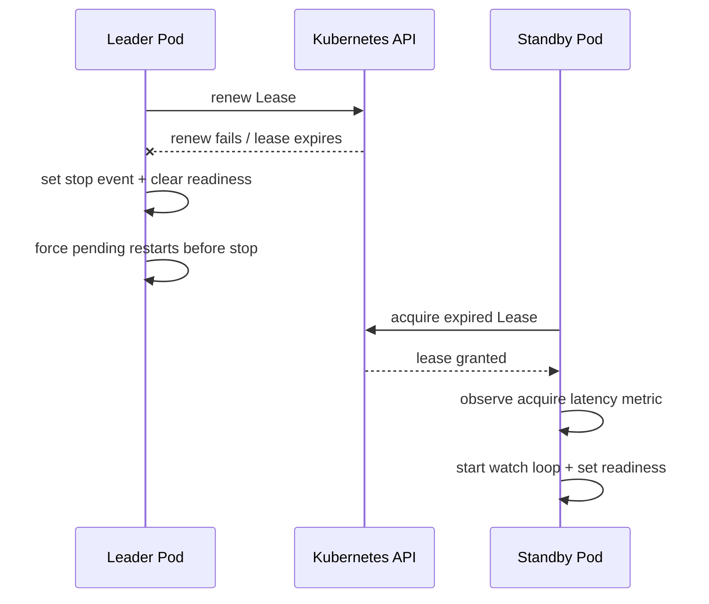

# Controller Internals

Technical deep-dive into the ConfigMap reload controller for developers who
need to debug, extend, or operate it.

## Overview

The controller (`controller/src/controller.py`) is a single-threaded
list-watch loop that:

1. Lists all ConfigMaps matching the app selector to seed a data-hash cache.
2. Reconciles startup drift using deployment template hash annotations.
3. Opens a Kubernetes watch stream from the list's `resourceVersion`.
4. For each event, determines whether the ConfigMap data actually changed.
5. If it changed, triggers a rolling restart of matching Deployments (scoped
   by the `env` label).

```
                    ┌─────────────┐
                    │  list CMs   │  seed _last_data_hash
                    └──────┬──────┘
                           │
                    ┌──────▼──────┐
              ┌────►│  watch CMs  │◄──── timeout / stream end
              │     └──────┬──────┘
              │            │ event
              │     ┌──────▼──────────┐
              │     │ filter & hash   │  _has_meaningful_data_change()
              │     └──────┬──────────┘
              │            │ changed?
              │      ┌─────┴─────┐
              │     yes          no ──► discard
              │      │
              │ ┌────▼────────┐
              │ │  debounce?  │
              │ └──┬──────┬───┘
              │   no      yes ──► _schedule_pending_restart()
              │    │
              │ ┌──▼──────────────┐
              │ │ patch Deploys   │  _restart_deployments_for_env()
              │ └──┬──────────────┘
              │    │
              │ ┌──▼──────────────┐
              └─┤ drain pending   │  _drain_pending_restarts()
                └─────────────────┘
```

## Watch Loop Lifecycle (`run_forever`)

### Startup

1. `list_namespaced_config_map()` fetches all ConfigMaps with the app
   selector.
   - Transient failures retry with exponential backoff (1s to 30s, jittered).
   - `401/403` errors are treated as fatal RBAC/auth configuration errors and
     terminate the controller loop.
2. `_sync_cache_from_list(initial, restart_on_change=False)` populates
   `_last_data_hash` without triggering restarts — this is the baseline.
3. `_reconcile_startup_drift(initial)` compares ConfigMap hashes against
   deployment hash annotations and restarts stale workloads when drift is
   detected.
4. `self.ready.set()` signals the health server's `/readyz` endpoint.

### Steady state

The watch stream delivers `ADDED`, `MODIFIED`, and `DELETED` events.

- **ADDED with no prior hash baseline:** Suppressed and used to seed
  `_last_data_hash` (covers initial replay and new ConfigMaps observed for the
  first time).
- **ADDED/MODIFIED with prior baseline:** Hashed and compared. If the hash
  differs, a restart is triggered (or debounced).
- **DELETED:** Ignored — deleting a ConfigMap does not require a restart.

### Error handling

| Error | Behaviour |
|-------|-----------|
| `410 Gone` | etcd compacted past our `resourceVersion`.  Re-list with `restart_on_change=True` to catch any missed changes, then resume watching from the new `resourceVersion`. |
| Other `ApiException` | Log, increment `watch_errors_total`, sleep with jittered exponential backoff (1 s → 30 s cap), then retry. |
| Unexpected exception | Same backoff path.  The `finally` block always calls `watcher.stop()`. |

Backoff is reset to 1 second on every successful watch iteration.

## Data Hash Cache

```
_last_data_hash: dict[(env, configmap_name) → sha256_hex]
```

- Populated at startup from the list.
- Updated on every relevant event.
- Compared before triggering a restart — identical hashes mean no restart.

This prevents false-positive restarts from:
- Watch replay ADDED events.
- `kubectl apply` that doesn't change data.
- Label/annotation-only edits.

## Pending Restart Queue

```
_pending_restarts: dict[(env, configmap_name) → due_at_monotonic]
```

When a restart is needed but the debounce window has not elapsed:

1. `_schedule_pending_restart()` records `now + remaining_debounce` as the
   due-at time.
2. If another change arrives within the window, the due-at is pushed
   *forward* (coalescing).
3. `_next_watch_timeout_seconds()` shortens the watch timeout so the loop
   wakes up when the earliest pending restart is due.
4. `_drain_pending_restarts()` executes all restarts whose due-at has passed.

If a restart attempt fails (for example transient `ApiException 500`), the
same queue key is reused for retry:
- Retry delay uses bounded exponential backoff (`1s`, `2s`, `4s`, ... capped at `30s`).
- Retry state is reset when a fresh ConfigMap change supersedes the old intent.
- Successful restart clears both pending due-at and retry-attempt state.

This is called:
- At the top of every watch loop iteration.
- After every event.
- After the watch stream ends or errors.

## Leader Election Integration

The controller runs inside a leader election wrapper (`controller/src/leader.py`):

```
main()
  └─► LeaseLeaderElector.run()
        ├─► on_started_leading()  → spawns controller.run_forever() in a thread
        └─► on_stopped_leading()  → calls controller.request_stop(), sets stop event, joins thread
```

- Only the leader replica runs the watch loop.
- The standby replica polls the Lease every `retry_period_seconds` (2 s).
- The leader steps down after missing renewals for
  `renew_deadline_seconds` (default 10 s), and the standby takes over once
  the lease expires (`lease_duration_seconds`, default 15 s).
- The controller thread receives a `shutdown_event` (`threading.Event`) that
  is set when leadership is lost or a SIGTERM/SIGINT is received.
- `controller.request_stop()` also calls `watcher.stop()` to interrupt long
  watch timeouts immediately during handoff.
- Thread-stop join timeout is configurable via
  `LEADER_ELECTION_CONTROLLER_STOP_TIMEOUT_SECONDS` (default `45`).
- If the old watch loop thread does not stop before timeout, process-level
  shutdown is triggered to prevent overlapping watch loops.
- Expected `on_stopped_leading` transitions are non-fatal and do not force
  global process shutdown. Global shutdown is set only if the controller thread
  crashes or exits unexpectedly without a stop signal.
- In leader-election mode, `/readyz` is leadership-aware and returns `503`
  when the pod is not the active leader.

Leader handoff sequence:



## Restart Mechanism

Rolling restarts use the same approach as `kubectl rollout restart`:

```python
patch_deployment_restart(apps_api, namespace, name, annotation_key, timestamp)
```

This patches the Deployment's `.spec.template.metadata.annotations` with:
- `shipshape.io/restartedAt: <RFC3339>`
- `shipshape.io/config-hash-<configmap_name>: <sha256>`

Kubernetes treats this as a pod template change and rolls new pods according
to the Deployment's `strategy` (RollingUpdate by default). The hash annotation
is also used during startup drift reconciliation.

## Metrics

All metrics are exported on `:8080/metrics` (Prometheus text format):

| Metric | Type | Labels | Description |
|--------|------|--------|-------------|
| `configmap_reload_restarts_total` | Counter | `env` | Successful deployment restarts |
| `configmap_reload_errors_total` | Counter | `env` | Failed restart patch attempts |
| `configmap_reload_debounced_total` | Counter | `env` | Events suppressed by debounce |
| `configmap_reload_watch_errors_total` | Counter | — | Watch stream errors |
| `configmap_reload_watch_reconnects_total` | Counter | — | Watch stream reconnects after first connect |
| `configmap_reload_leader_transitions_total` | Counter | `transition` | Leadership transitions (`acquired`/`lost`) |
| `configmap_reload_leader_state` | Gauge | — | `1` when this replica is leader, otherwise `0` |
| `configmap_reload_leader_acquire_latency_seconds` | Histogram | — | Time spent waiting to acquire leadership |
| `configmap_reload_pending_restarts` | Gauge | — | Pending debounced restart queue depth |
| `configmap_reload_retry_total` | Counter | `env` | Retry attempts scheduled after failed restart operations |
| `configmap_reload_dropped_restarts_total` | Counter | — | Pending restart flush failures during shutdown/leadership handoff |
| `configmap_reload` | Info | — | Build metadata |

## Debugging Checklist

1. **Controller not restarting after ConfigMap change:**
   - Check logs for "Ignoring unchanged data" → data hash didn't change.
   - Check logs for "Debounced" → restart is pending, wait for the window.
   - Verify the ConfigMap has `app=helloworld` and `env=<test|prod>` labels.

2. **Controller crash-looping:**
   - Check RBAC: `kubectl auth can-i` for configmaps (get/list/watch) and
     deployments (get/list/patch).
   - Check leader election lease: `kubectl get lease -n shipshape`.

3. **Restarts affecting wrong environment:**
   - Verify `env` label on both ConfigMap and Deployment.
   - Check `_deployment_selector_for_env()` is appending the correct
     `env=<value>` clause.

## Edge Cases & Known Limitations

### ADDED Event Handling
ADDED events are processed through `_has_meaningful_data_change()` which
checks for a prior hash baseline:
- **No prior baseline:** The hash is seeded and no restart occurs. This
  handles both initial watch replay and brand-new ConfigMaps appearing
  mid-watch.
- **Prior baseline exists with different hash:** A restart is triggered.
  This handles ConfigMap recreation (delete + create) during a watch.

### Startup Drift Reconciliation Scope
Startup reconciliation depends on deployment template hash annotations written
by prior controller-managed restarts:
- **Hash annotation differs from current ConfigMap hash:** Restart is triggered
  immediately at startup to reconcile drift that occurred while controller was down.
- **Legacy restart annotation exists but hash annotation is missing:** A one-time
  repair restart is triggered to seed hash annotations.
- **Neither restart nor hash annotation exists:** Deployment is treated as
  baseline-unknown and startup reconciliation is skipped for that deployment.

### DELETE Events
ConfigMap `DELETED` events are intentionally ignored. Deleting a ConfigMap
does not trigger a restart because:
- The application will continue running with its current environment.
- A missing ConfigMap will surface as a startup failure on the next pod
  restart (caught by readiness probes and `ConfigError`).
- Alerting on deletion is better handled by Kubernetes audit logs or a
  separate policy controller.

### Restart Failure Semantics
Restart intents are considered complete only when an attempt finishes with
`failed == 0`:
1. Failed attempts are retried with bounded exponential backoff.
2. Already-reconciled deployments are skipped on retries using the
   `shipshape.io/config-hash-<configmap>` annotation check.
3. Fresh ConfigMap changes reset retry attempt state and supersede stale retry
   windows for the same `(env, configmap_name)` key.

### Pending Restarts on Shutdown
When the controller receives a shutdown signal (SIGTERM or leadership loss),
it force-processes all pending debounced restarts:
1. Restarts past due-at are processed as normal.
2. Restarts still within the debounce window are executed immediately during
   shutdown/handoff to avoid losing an already observed config change.
3. `configmap_reload_dropped_restarts_total` only increments if a forced
   shutdown flush still fails and the intent must be dropped.

### Restart Annotation Timestamp Precision
The restart annotation uses second-level precision (`2024-01-15T08:30:00Z`).
Two restarts within the same second produce the same annotation value,
meaning the second restart is a no-op from Kubernetes' perspective. This
is acceptable because:
- The debounce window (default 5 s) prevents sub-second restart bursts.
- Even without debounce, the hash check ensures only genuine data changes
  trigger restarts, so a duplicate annotation within one second means the
  same logical change.

### Configuration Validation
`APP_SELECTOR` and `WATCH_NAMESPACE` are validated at startup in
`build_controller_from_env()`. Invalid selectors (no `key=value` pair) or
empty namespaces raise `ValueError` and prevent the controller from starting
with silently degraded behavior.
